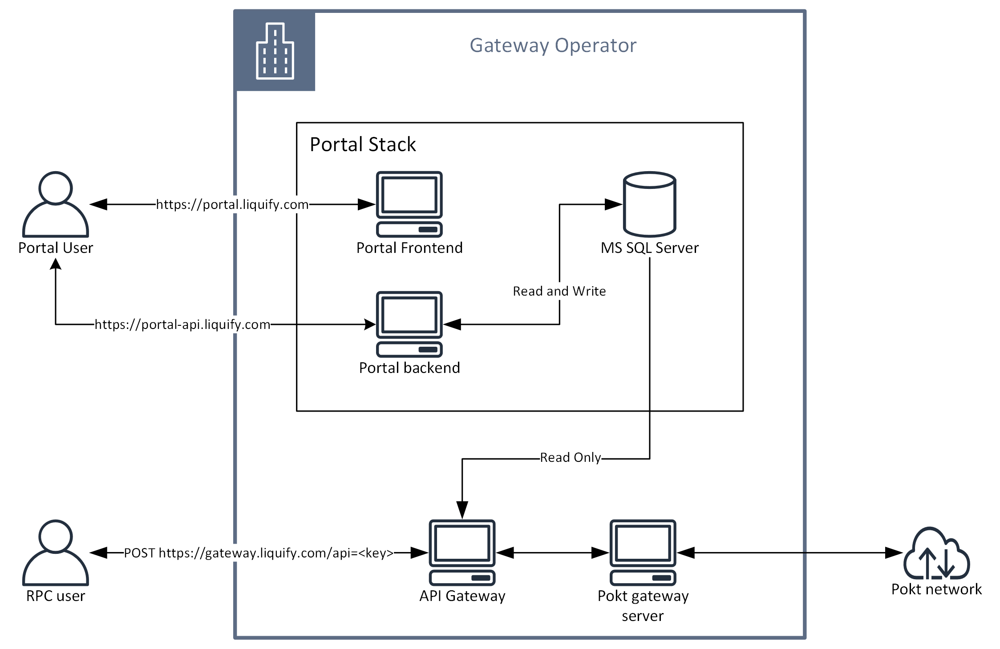

# Liquify Pokt Gateway Backend

NOTE: This is still a work in progress!

Welcome to Liquify's gateway portal backend repository! This repository houses the essential components that power our gateway infrastructure, designed to seamlessly integrate with our frontend applications.

## Components

The API Gateway, written in Go, acts as a middleware between clients and pokt gateway servers. It verifies API keys stored in a MySQL database, caches them for efficiency, enforces rate limiting, and forwards requests to backend servers. The gateway also logs Prometheus metrics, tracking requests by API key, cache hits, and total HTTP requests, along with rate limiting information.

#### Features

- **API Key Verification**: Keys passed in the path (`/api=<key>`) are verified against a MySQL database.
- **Caching**: Validated keys are cached for 1 hour to minimize database queries and improve performance.
- **Rate Limiting**: Requests from each API key are rate-limited, returning a 429 status code if the limit is breached.
- **Forwarding**: Requests with valid keys are forwarded to backend servers, and responses are sent back to the caller.
- **Prometheus Metrics**: Metrics are logged on a per API key basis, including requests by API key, cache hits, and total HTTP requests, providing insights into gateway performance.

## How to Use
TODO

## Feedback and Support
If you have any questions, feedback, or require assistance, please contact our team at [contact@liquify.io](mailto:contact@liquify.io). We're here to support you in leveraging our gateway backend effectively.
